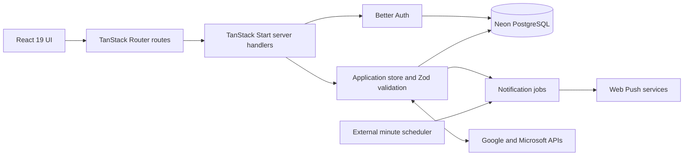

# Routempo

> A timezone-aware routine planner for deciding what comes next, recording what actually happened, and learning from real outcomes without turning the day into a scorecard.

[](https://routempo.netlify.app)
[](https://www.supportkori.com/montasim)

Routempo helps people build repeatable daily rhythms. Users can schedule one-off or recurring routines, complete or skip each occurrence, review behavior history and insights, receive browser reminders, and move routines between Routempo and Google or Microsoft calendars and task lists.

This repository contains the full-stack web application, its versioned mobile API, the native Kotlin/Compose Android application, Neon PostgreSQL schema and migrations, product prototypes, a reusable design system, and automated tests.

**[Open the live app](https://routempo.netlify.app) · [Review the Android prototype](prototypes/android/v1/README.md) · [Review the web prototype](prototypes/web/v1/README.md) · [Report an issue](https://github.com/montasim/Routempo/issues)**

> [!NOTE]
> Routempo is under active development. The public deployment is available for evaluation, but it has no uptime or availability commitment.

## Why Routempo?

Routine tools often emphasize planning or streaks but provide little context about what was actually completed, skipped, or missed. Routempo keeps those jobs connected:

1. Plan a realistic routine in the user’s saved timezone.
2. Act on the next scheduled item from a focused Today view.
3. Record the outcome without rewriting the underlying schedule.
4. Review behavior logs and practical patterns over time.

New accounts begin empty. The interface guides the user toward one useful routine instead of presenting sample activity that could be mistaken for their own data.

## Current capabilities

### Plan and act

- One-off, daily, weekly, monthly, and yearly routines
- Multiple weekdays for weekly recurrence and optional recurrence end dates
- Week navigation, per-day planning, and a separate routine-management view
- Routine editing, pausing, resuming, and deletion with confirmation where data loss is possible
- A timezone-aware Today view with the next routine, later routines, completion, and skipping
- Empty and filtered-empty states that explain the next useful action

### Record and review

- Completed, skipped, and missed behavior logs
- Manual log creation, editing, filtering, expansion, and deletion
- Insight ranges for 7, 30, and 90 days
- Completion summaries, recent activity, weekday patterns, and category breakdowns derived from saved routines and outcomes
- Category creation, renaming, usage checks, and deletion protection while a category is still assigned

### Personalize and move data

- Device-timezone detection on first use and a searchable IANA timezone picker
- All planning and display calculations use the user’s saved timezone
- Default reminder offsets from the scheduled time through one hour before
- Light and dark themes
- Versioned JSON export of settings, categories, routines, and behavior logs
- Validated JSON import with an explicit replace confirmation

### Connect and notify

- Configurable Google and Microsoft sign-in through Better Auth
- Optional Google Calendar, Google Tasks, Microsoft Outlook Calendar, and Microsoft To Do batch sync
- Optional standards-based Web Push reminders and Monday summaries
- An installable web-app manifest and notification service worker

## Using the application

### Start a routine

1. Sign in with Google or Microsoft.
2. Confirm the detected timezone in **Settings**.
3. Select **Add routine** from Today or Plan.
4. Choose a name, category, start date, time, and recurrence.
5. Return to Today when the routine is due, then mark it complete or skip it.
6. Review the resulting event in Logs and the emerging pattern in Insights.

Routines cannot be added to dates that have already passed in the saved timezone.

### Import and export account data

Settings can download a `routempo-data-export` JSON file containing the current settings, categories, routines, and logs. Import accepts only the versioned Routempo format and validates field limits, timestamps, timezones, recurrence values, and duplicate IDs.

> [!WARNING]
> Import is a replacement, not a merge. Confirming an import atomically replaces the account’s settings, categories, routines, and behavior logs. It also clears integration-item mappings because the imported routines may use different identifiers. Export a backup first.

The browser rejects import files larger than 10 MB. The format currently permits at most 1,000 routines, 500 categories, and 10,000 logs.

### Sync calendars and tasks

Connect a provider separately from sign-in in **Settings → Calendar and task integrations**. Routempo then supports explicit import and export actions:

- Calendar import reads upcoming events in the next 90 days.
- Task import reads open tasks from available provider lists.
- Imported items become one-off Routempo routines.
- Export sends enabled routines to the provider’s primary calendar or default task list.
- Provider-item mappings prevent the same item from being imported or exported repeatedly.

Sync is batch-oriented rather than continuous two-way synchronization. A single export processes at most 250 routines, and provider failures are reported to the user.

## Local development

### Prerequisites

- Node.js 24; the current toolchain is verified with Node.js `24.17.0`
- pnpm; the repository is currently verified with pnpm `11.22.0`
- A [Neon](https://neon.com/) PostgreSQL database
- Google Chrome at `/usr/bin/google-chrome` when running Playwright with the committed configuration
- Optional Google Cloud and Microsoft Entra applications for OAuth and external sync

### 1. Clone and install

```bash
git clone https://github.com/montasim/Routempo.git
cd Routempo
pnpm install --frozen-lockfile
```

### 2. Configure the environment

```bash
cp apps/web/.env.example apps/web/.env
openssl rand -base64 32
```

Add the generated value to `apps/web/.env` as `BETTER_AUTH_SECRET`, keep `BETTER_AUTH_URL=http://localhost:3000`, and replace `DATABASE_URL` with the pooled connection URL from Neon. Do not commit `.env` or use template secrets in production.

### 3. Apply database migrations

```bash
pnpm web:db:migrate
```

Drizzle Kit and the application both use `DATABASE_URL`. Database failures are surfaced; the application does not silently fall back to temporary in-memory storage.

### 4. Start the application

```bash
pnpm web:dev
```

Open [http://localhost:3000](http://localhost:3000). During development, [http://localhost:3000/today?demo=true](http://localhost:3000/today?demo=true) uses the development demo identity and is the shortest path when OAuth is not configured. It still reads and writes the configured database.

### 5. Build the Android application

Open `apps/mobile` in Android Studio, or build it from a terminal with JDK 17 and Android SDK 36 configured:

```powershell
cd apps/mobile
$env:JAVA_HOME = "path-to-jdk-17"
$env:ANDROID_SDK_ROOT = "path-to-android-sdk"
.\gradlew.bat testDebugUnitTest lintDebug assembleDebug
```

The application ID is `com.montasim.routempo` (`.debug` is appended to debug builds). Debug and release builds call the production v1 API by default, while local Android development can explicitly override the debug endpoint. Android versions are managed independently in `apps/mobile/version.properties`, and signed APKs are distributed through GitHub Releases using tags such as `android-v1.0.0`. See the [mobile workspace guide](apps/mobile/README.md) for emulator, authentication callback, API overrides, signing, artifact naming, and release instructions.

## Configuration

| Variable                  | Required                | Purpose                                                                    |
| ------------------------- | ----------------------- | -------------------------------------------------------------------------- |
| `DATABASE_URL`            | Yes                     | Pooled Neon PostgreSQL connection used by the app and Drizzle Kit          |
| `BETTER_AUTH_SECRET`      | Yes                     | Protects Better Auth state; use a unique high-entropy value                |
| `BETTER_AUTH_URL`         | Yes                     | Canonical application origin, such as `http://localhost:3000`              |
| `GOOGLE_CLIENT_ID`        | For Google auth/sync    | Google OAuth client identifier                                             |
| `GOOGLE_CLIENT_SECRET`    | For Google auth/sync    | Google OAuth client secret                                                 |
| `MICROSOFT_CLIENT_ID`     | For Microsoft auth/sync | Microsoft Entra application identifier                                     |
| `MICROSOFT_CLIENT_SECRET` | For Microsoft auth/sync | Microsoft Entra client secret                                              |
| `MICROSOFT_TENANT_ID`     | No                      | Entra tenant; defaults to `common` for personal, work, and school accounts |
| `VAPID_PUBLIC_KEY`        | For Web Push            | Public application-server key exposed to subscribing browsers              |
| `VAPID_PRIVATE_KEY`       | For Web Push            | Private application-server key used by the dispatcher                      |
| `VAPID_SUBJECT`           | For Web Push            | Monitored `mailto:` address or HTTPS URL identifying the sender            |
| `CRON_SECRET`             | For Web Push            | Bearer token protecting the notification endpoint                          |

Production must configure at least one OAuth provider because email/password authentication is disabled. The login page currently renders both provider choices even when one provider is unconfigured, so configure both or expect the unavailable option to fail visibly.

### OAuth callbacks and scopes

| Provider        | Local callback                                                      |
| --------------- | ------------------------------------------------------------------- |
| Google          | `http://localhost:3000/api/auth/callback/google`                    |
| Microsoft Entra | `http://localhost:3000/api/auth/oauth2/callback/microsoft-entra-id` |

Enable Google Calendar API and Google Tasks API for Google sync. Microsoft sync requests delegated `Calendars.ReadWrite` and `Tasks.ReadWrite` permissions. Routempo requests these integration scopes separately from ordinary sign-in.

## Reminders and weekly summaries

Generate one stable VAPID key pair per deployment:

```bash
pnpm web:push:keys
```

After setting the VAPID variables and `CRON_SECRET`, configure an external scheduler to call the dispatcher every minute:

```bash
curl -X POST \
  -H "Authorization: Bearer $CRON_SECRET" \
  https://your-routempo-host.example/api/notifications/run
```

Routempo maintains a rolling seven-day set of timezone-aware jobs in PostgreSQL. The dispatcher leases due jobs, limits duplicate delivery per browser subscription, retries transient failures up to five attempts, removes expired subscriptions, and expires reminders that are more than one hour late.

Browser permission is requested only after the user enables notifications. Web Push requires HTTPS in production; localhost is permitted for development. On iPhone and iPad, the web app must first be installed on the Home Screen. See the [reminder implementation research](docs/research/web-reminders.md) for protocol and browser details.

> [!IMPORTANT]
> Reminders are organizational aids, not guaranteed alarms. Delivery depends on the external scheduler, deployment, browser subscription, operating system, and browser push service.

## Architecture



The client loads authenticated application data from `/api/app` and applies serialized optimistic mutations. The server validates requests with Zod, writes through Drizzle ORM using Neon’s HTTP driver, and returns the refreshed account state. Failed mutations roll the client back to the last confirmed state.

### Main data boundaries

| Area           | Stored data                                                           |
| -------------- | --------------------------------------------------------------------- |
| Authentication | Users, OAuth accounts and tokens, sessions, verification records      |
| Planning       | User settings, categories, routine definitions and recurrence fields  |
| Outcomes       | Per-date routine occurrences and behavior-log snapshots               |
| Notifications  | Browser subscriptions, scheduled jobs and delivery-deduplication keys |
| Integrations   | External-provider item IDs mapped to Routempo routine IDs             |

The schema and generated migrations live in [`apps/web/src/db/schema.ts`](apps/web/src/db/schema.ts) and [`apps/web/drizzle/`](apps/web/drizzle/). The data-layer rationale is recorded in the [Neon and Drizzle research note](docs/research/neon-data-layer.md).

### Application routes

| Route                    | Purpose                                                         | Access                     |
| ------------------------ | --------------------------------------------------------------- | -------------------------- |
| `/login`                 | Google or Microsoft sign-in                                     | Public                     |
| `/today`                 | Current routine execution and weekly snapshot                   | Authenticated              |
| `/plan`                  | Week planning and routine management                            | Authenticated              |
| `/insights`              | Outcome summaries and patterns                                  | Authenticated              |
| `/logs`                  | Behavior-log review and manual editing                          | Authenticated              |
| `/settings`              | Profile, timezone, reminders, categories, data and integrations | Authenticated              |
| `/terms`, `/privacy`     | Bundled legal copy                                              | Public                     |
| `/api/app`               | Internal application-data API                                   | Authenticated              |
| `/api/v1/*`              | Versioned Android and first-party client API                    | Mixed; bearer or cookie    |
| `/api/integrations`      | Internal provider sync API                                      | Authenticated              |
| `/api/push`              | Push configuration and subscription API                         | Authenticated              |
| `/api/notifications/run` | Notification dispatcher                                         | `CRON_SECRET` bearer token |

The legacy application routes remain internal implementation surfaces. `/api/v1` is the documented, versioned interface for the first-party Android app; its contract is published in [`docs/api/openapi-v1.yaml`](docs/api/openapi-v1.yaml).

## Technology

| Area             | Current implementation                                   |
| ---------------- | -------------------------------------------------------- |
| Applications     | TanStack Start/React web; Kotlin/Jetpack Compose Android |
| Build and server | Vite 8 and Nitro 3                                       |
| Interface        | Tailwind CSS 4, shadcn/ui, Radix UI, Lucide, Sonner      |
| Data             | Neon PostgreSQL, Drizzle ORM and Drizzle Kit             |
| Authentication   | Better Auth with Google and Microsoft Entra OAuth        |
| Validation       | Zod                                                      |
| Notifications    | Web Push, VAPID, service workers and PostgreSQL jobs     |
| Testing          | Vitest, Testing Library and Playwright                   |

## Development commands

| Command                | Purpose                                                                         |
| ---------------------- | ------------------------------------------------------------------------------- |
| `pnpm web:dev`         | Start the web app's Vite server on port 3000                                    |
| `pnpm web:build`       | Create the production web client and Nitro server output                        |
| `pnpm web:start`       | Start `apps/web/.output/server/index.mjs`, loading `apps/web/.env` when present |
| `pnpm web:typecheck`   | Run TypeScript for the web app without emitting files                           |
| `pnpm web:test`        | Run the web app's Vitest unit and component suite                               |
| `pnpm web:test:e2e`    | Start the web dev server and run Playwright serially                            |
| `pnpm web:format`      | Format only the web workspace with Prettier; this writes files                  |
| `pnpm format`          | Format the entire repository with Prettier; this writes files                   |
| `pnpm web:db:generate` | Generate a migration from the web app's Drizzle schema                          |
| `pnpm web:db:migrate`  | Apply pending web migrations to `DATABASE_URL`                                  |
| `pnpm web:db:studio`   | Open Drizzle Studio for the configured web database                             |
| `pnpm web:push:keys`   | Generate a VAPID key pair for the web app                                       |

> [!CAUTION]
> The browser suite uses the `development-demo` account in the configured database. Regression tests replace that account’s data while they run. Point `DATABASE_URL` at a disposable Neon branch or test database before running `pnpm web:test:e2e`.

## Deployment and operations

The public application is deployed on Netlify at [routempo.netlify.app](https://routempo.netlify.app). Another deployment must support the generated Nitro Node server, provide all required environment variables, connect to Neon, and run:

```bash
pnpm web:build
pnpm web:start
```

Before serving production traffic:

1. Apply reviewed database migrations and keep a recoverable database backup.
2. Set the canonical HTTPS `BETTER_AUTH_URL` and matching OAuth callbacks.
3. Use unique production secrets and stable VAPID keys.
4. Configure the minute-level scheduler if reminders are enabled.
5. Verify provider scopes, push delivery, legal copy, and retention expectations.
6. Run unit tests, type checking, the production build, and relevant browser workflows.

The Android GitHub Release workflow runs native unit tests and release lint, creates a signed versioned APK, verifies its signature, generates a SHA-256 checksum, and publishes both assets for matching `android-v*` tags. Web checks remain local until a web CI workflow is added.

## Status, privacy, and limitations

- Routempo is under active development. Its public Netlify deployment has no uptime or availability commitment.
- A Neon database is always required, including for the development demo identity.
- The application has no offline data cache. Its manifest and service worker support installation and push notifications, not offline use.
- Browser reminders require explicit permission and a working external scheduler. Signing out currently ends the session but does not remove the server-side push subscription for that browser.
- Calendar/task integration is explicit batch sync, not a continuously reconciled two-way source of truth.
- OAuth account records may contain provider access and refresh tokens. Database access, logs, backups, and production secrets must be protected accordingly.
- Push endpoints and subscription key material are credentials and must not be logged or exposed to other users.
- Behavior logs can currently be added, edited, and deleted by the account owner; “history” is not an immutable compliance audit trail.
- The bundled Terms and Privacy pages require deployment-specific legal review against the configured providers, operator, jurisdiction, retention policy, and support channel.
- Historical planning documents under `docs/` may describe superseded architectures. The current `apps/web` source, `apps/web/package.json`, `apps/web/.env.example`, Drizzle schema, and migrations are authoritative for the web app; the root `package.json` defines workspace orchestration commands.

The codebase has no advertising or product-analytics integration. Application data is nevertheless processed by the deployment’s database, authentication provider, hosting environment, browser push service, and any Google or Microsoft integration the user connects.

## Project structure

```text
apps/web/src/components/ Product pages, app shell and shadcn-based UI
apps/web/src/db/         Neon client and Drizzle schema
apps/web/src/lib/        Domain rules, persistence, auth, push and integrations
apps/web/src/routes/     TanStack application and server routes
apps/web/drizzle/        Ordered PostgreSQL migrations and snapshots
apps/web/tests/e2e/       Playwright workflows and regressions
apps/mobile/              Native Kotlin/Compose Android application workspace
prototypes/android/v1/   Android app prototype and implementation contract
prototypes/web/v1/       Current web product prototype
docs/design_system/      Routempo visual tokens, components and guidance
docs/research/           Evidence-backed architecture research
```

## Documentation

- [Android v1 prototype and API guide](prototypes/android/v1/README.md)
- [Web v1 prototype guide](prototypes/web/v1/README.md)
- [Mobile API OpenAPI contract](docs/api/openapi-v1.yaml)
- [Routempo design system](docs/design_system/readme.md)
- [Neon PostgreSQL and Drizzle decision](docs/research/neon-data-layer.md)
- [Web reminders and weekly summaries](docs/research/web-reminders.md)
- [Environment template](apps/web/.env.example)
- [Database schema](apps/web/src/db/schema.ts)

## Support and security

Use [GitHub Issues](https://github.com/montasim/Routempo/issues) for reproducible, non-sensitive bugs and feature requests. Include the affected route, browser, timezone, expected behavior, actual behavior, and reproduction steps.

Do not disclose credentials, OAuth tokens, database URLs, push subscription details, private routine content, or vulnerabilities in a public issue. The repository does not yet include a dedicated `SECURITY.md` or private vulnerability-reporting address; contact the repository owner privately through [GitHub](https://github.com/montasim) until one is established.

## Contributing

The repository does not yet include a contribution guide or code of conduct. Before starting a material change, open an issue to align on scope. For a code contribution:

1. Create a focused branch.
2. Update or add tests for changed behavior.
3. Run `pnpm web:typecheck`, `pnpm web:test`, `pnpm web:build`, and relevant Playwright workflows.
4. Keep secrets and personal data out of commits and test output.
5. Submit a pull request describing the user-visible outcome and verification performed.

## Funding

Optional financial support helps cover hosting, database costs, and continued development.

[](https://www.supportkori.com/montasim)

Bug reports, focused pull requests, testing feedback, and documentation corrections are equally valuable ways to support the project.

## Maintainer

Routempo is maintained by [Montasim](https://github.com/montasim).

## License

No `LICENSE` file is currently present. The repository therefore does **not** grant an open-source license or permission to reuse, modify, or redistribute the code. Add a license file only after the repository owner chooses and authorizes one.
